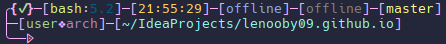

# My custom bash prompt



### Features

- **Decoration**
- **First line**:
  - **Failed command**: If the last command failed, the prompt will show a blinking indicator.
  - **Shell**: Shows the current shell in the prompt.
  - **Version**: Shows the current shell version.
  - **Current Time**: Shows the current time in the prompt.
  - **IP**: Shows the local as well as the public(IPv4/IPv6) IP or "offline".
      - the IP is cached to make the prompt "print" faster instead of waiting a whole second for the web request to finish.
  - **Git branch**: Shows the current git branch or "no repo".
- **Second line**:
  - **User**: Current user
  - **Hostname**: Hostname of the machine
  - **Directory**: Current working directory
- **Third line**:
  - **Decoration**: fancy decorator for the prompt


### Modularity

## [ DOCUMENTATION IN PROGRESS ]

### Full .bashrc

```
# cron-job
# */5 * * * * getip

# get public IP
# disabled for faster startup (cron-job refreshes cache every 5 minutes)
#if ! curl -s ifconfig.me/ip > $ip_cache_public; then echo -e "offline" > $ip_cache_public; fi

# get local IP
#if [ "$(ip route get 1.1.1.1 2>&1)" == "RTNETLINK answers: Network is unreachable" ];\
 then echo -e "offline" > $ip_cache_local;\
 else ip route get 1.1.1.1 | awk -F "src " 'NR == 1{ split($2, a," ");print a[1]}' > $ip_cache_local; fi

# cache for faster response
ip_cache_public=~/.cache/ip_public
ip_cache_local=~/.cache/ip_local

# manual ip refresh
alias getip='if ! curl -s ifconfig.me/ip > $ip_cache_public;\
 then echo -e "offline" > $ip_cache_public;\
fi; if [ "$(ip route get 1.1.1.1 2>&1)" == "RTNETLINK answers: Network is unreachable" ];\
 then echo -e "offline" > $ip_cache_local;\
 else ip route get 1.1.1.1 | awk -F "src " '\''NR == 1{ split($2, a," ");print a[1]}'\'' > $ip_cache_local;\
fi'

PROMPT_COMMAND='local_ip=$(cat $ip_cache_local);\
git_branch=$(git rev-parse --abbrev-ref HEAD 2>/dev/null || echo "no repo");\
public_ip=$(cat $ip_cache_public);'

PS1='$(if [ $? -eq 0 ]; then \
echo -e "\n\e[38;5;219m╭\e[0m\e[38;5;219;1m{\e[92m✓\e[38;5;219;1m}\e[0m\[\e[38;5;219m\]─[\[\e[38;5;192m\]\s\[\e[0m\]:\[\e[38;5;24m\]\v\[\e[38;5;219m\]]\[\e[0m\]\[\e[38;5;219m\]─\e[0m\[\e[0;38;5;219m\][\[\e[38;5;221m\]\t\[\e[38;5;219m\]]\[\e[0m\]\e[0;38;5;219m─\e[0m\[\e[0;38;5;219m\][\[\e[0m\]\[\e[38;5;111m${local_ip}\e[38;5;219m\]]\[\e[0m\]\e[0;38;5;219m─\e[0m\[\e[0;38;5;219m\][\[\e[0m\[\e[38;5;244m\]${public_ip}\[\e[0m\]\e[38;5;219m\]]\[\e[0m\]\e[0;38;5;219m─\e[0m\[\e[0;38;5;219m\][\[\e[0m\[\e[38;5;228m\]${git_branch}\[\e[0m\]\e[38;5;219m\]]\[\e[0m\]\n\e[0m\]"; \
else \
echo -e "\n\e[38;5;219m╭\e[0m\e[38;5;219;1m{\e[91;5m✗\e[0;38;5;219;1m}\e[0m\[\e[38;5;219m\]─[\[\e[38;5;192m\]\s\[\e[0m\]:\[\e[38;5;24m\]\v\[\e[38;5;219m\]]\[\e[0m\]\[\e[38;5;219m\]─\e[0m\[\e[0;38;5;219m\][\[\e[38;5;221m\]\t\[\e[38;5;219m\]]\[\e[0m\]\e[0;38;5;219m─\e[0m\[\e[0;38;5;219m\][\[\e[0m\]\[\e[38;5;111m${local_ip}\e[38;5;219m\]]\[\e[0m\]\e[0;38;5;219m─\e[0m\[\e[0;38;5;219m\][\[\e[0m\[\e[38;5;244m\]${public_ip}\[\e[0m\]\e[38;5;219m\]]\[\e[0m\]\e[0;38;5;219m─\e[0m\[\e[0;38;5;219m\][\[\e[0m\[\e[38;5;228m\]${git_branch}\[\e[0m\]\e[38;5;219m\]]\[\e[0m\]\n\e[0m\]"; \
fi)\
\[\e[38;5;219m\]├─\e[0m\[\e[38;5;219m\][\[\e[92m\]\u\[\e[38;5;219m\]❖\[\e[38;5;140m\]\H\[\e[38;5;219m\]]\[\e[38;5;219m\]─\[\e[0;38;5;219m\][\[\e[38;5;123m\]\w\[\e[38;5;219m\]]\n\[\e[38;5;219m\]╰──𑁱\[\e[0m '
```